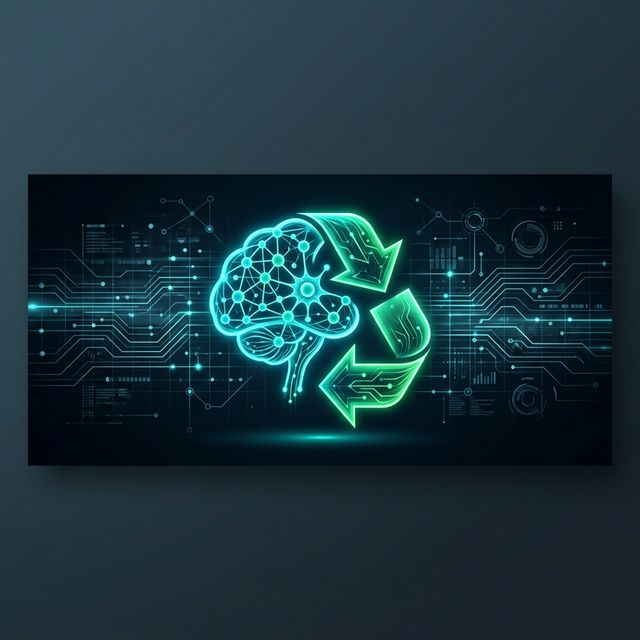

# 🚮 Hydra Bin: AI-Powered Edge Waste Classifier

> **Vision**: Bridging the gap between IoT and Machine Learning to automate sustainable waste management.

Hydra Bin is a high-performance, real-time waste classification system built with **Flutter** and **TensorFlow Lite**. It leverages the **EfficientNet-Lite** architecture to identify waste types (Biodegradable, Recyclable, Landfill) directly on edge devices, triggering automated sorting via **MQTT** and rewarding users via **Firebase**.

---

## 🚀 Advanced Engineering: The Challenge & The Solution

Building a real-time AI system on mobile hardware presents significant hurdles. Below are the specific technical challenges I encountered and the custom engineering solutions I designed to overcome them.

### 1. The Jitter Problem (Temporal Consistency)
**The Challenge**: In real-time inference, video frames can be noisy. A piece of plastic might be classified as "Recyclable" in one frame and "Landfill" in the next due to lighting or motion blur. Direct action based on a single frame caused "flickering" predictions.

**The Solution**: I implemented a **Temporal Consistency Buffer**.
*   **Mechanism**: The system maintains a sliding window of the last 20 classification results.
*   **Logic**: A classification is only "confirmed" if the buffer contains 20 *consecutive* identical labels with a confidence score exceeding **80%**.
*   **Result**: This eliminated false positives and created a rock-solid user experience that only triggers hardware when the AI is absolutely certain.

### 2. Mobile Latency & Thermal Throttling
**The Challenge**: Running a deep neural network on every single camera frame (30+ FPS) quickly drains battery and causes thermal throttling, leading to app lag.

**The Solution**: **Adaptive Inference Throttling & Byte-Level Preprocessing**.
*   **Throttling**: I implemented a 150ms execution gate (`cameraInterval`), limiting inference to ~6.6 FPS—sufficient for real-time feedback without overtaxing the CPU/NPU.
*   **Optimization**: Instead of using high-level image libraries, I wrote a custom `_preprocessImage` function that manipulates the raw `Uint8List` bytes from the camera stream directly, significantly reducing memory allocation overhead.

### 3. State Machine UX (Positional Grace Period)
**The Challenge**: Users need time to position the item in the camera frame. Starting inference immediately often led to the "Background" class being detected first, resetting the session prematurely.

**The Solution**: A **Positional State Machine**.
*   Implemented a **3-second Grace Period** during which the "Background" class is explicitly ignored, allowing the user to center the object.
*   Dynamic UI feedback: The "Hold Still" state triggers only when the AI reaches a 50%–79% confidence threshold, guiding the user to stabilize the item for final confirmation.

---

## 🛠️ Technical Architecture

### **Current Tech Stack**
*   **Frontend**: Flutter (Mobile/Guest App)
*   **Intelligence**: TensorFlow Lite (EfficientNet-Lite Model)
*   **Communication**: MQTT (IoT Device Control)
*   **Backend**: Cloud Firestore (Real-time Session Management & Point Awarding)
*   **Hardware Control**: Custom Host Service for QR-based edge pairing.

### **Model Specifications**
*   **Architecture**: EfficientNet-Lite0 (Optimized for Mobile)
*   **Input Size**: 224x224px (RGB)
*   **Quantization**: Float32 (optimized for precision) & INT8 (optimized for speed)
*   **Confidence Threshold**: 0.80 (80%)

---

## 📈 Impact & Future Roadmap
Hydra Bin isn't just an app; it's a prototype for a smarter city. By gamifying waste disposal through a points-based system, we encourage sustainable habits.

- [x] High-performance AI Inference Integration
- [x] Temporal Consistency Engine
- [x] Real-time Firebase Synchronization
- [x] MQTT-to-Hardware Bridge
- [ ] Multi-class expansion (Metal, Glass, E-waste)
- [ ] Offline-first local database for edge availability

---

### Developed by **Kurt Gerfred Caballero**
*A self-taught enthusiast pushing the boundaries of AI and IoT at age 14.*
