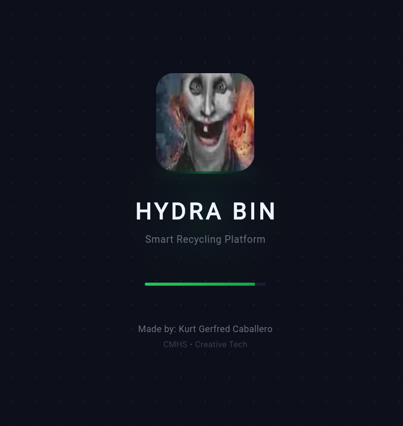
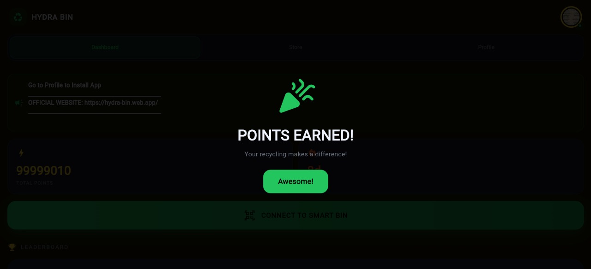
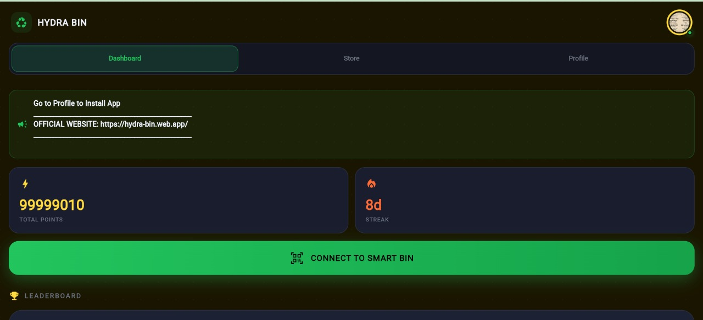
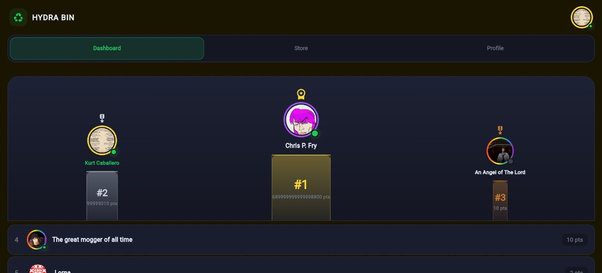
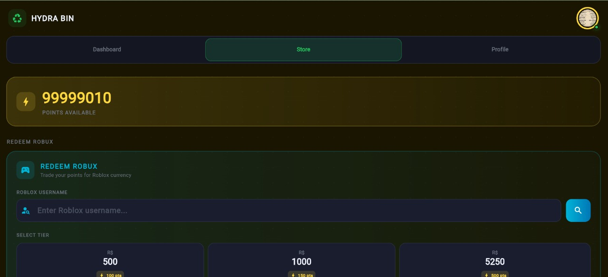
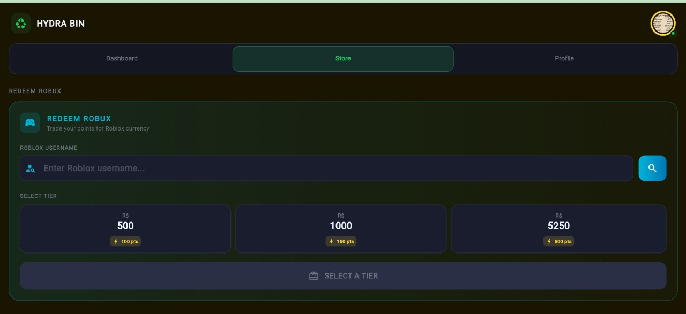
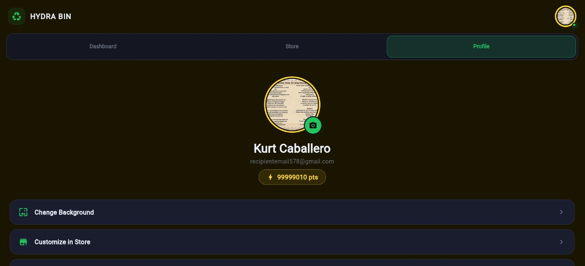
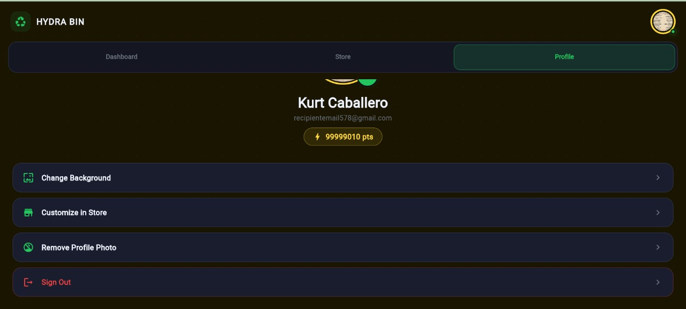

# 🌌 Hydra-Bin | AI-Powered Smart Recycling Ecosystem



> **Transforming Waste Management through Gamification and Real-time IoT Integration.**
> Created by Kurt Gerfred Caballero (CMHS • Creative Tech) - Age 14.

---

## 🚀 Overview

**Hydra-Bin** is not just a trash bin; it's a high-performance, cloud-integrated ecosystem designed to incentivize environmental responsibility. By combining **Flutter** cross-platform development with a robust **Firebase** backend, Hydra-Bin tracks recycling habits, rewards users with points, and fosters community competition through a real-time global leaderboard.

- **Frontend**: Flutter (Mobile & PWA Ready)
- **Backend**: Firebase Firestore (NoSQL), Auth, & Cloud Messaging (FCM)
- **Integrations**: Multi-vector Roblox API Bridge, Local Caching Layer

---

## 🛠️ Advanced Engineering Deep-Dives

As a 14-year-old developer, I believe in pushing the boundaries of what's possible. Below are two significant engineering challenges I encountered and the "advanced-level" solutions I implemented to solve them.

### 1. The "CORS & Rate-Limit" Bridge (Roblox Integration)
**The Problem:** Integrating Roblox user authentication and Robux redemption on a web/PWA platform is notoriously difficult due to strict CORS policies and aggressive rate-limiting on Roblox's public API endpoints.

**The Solution:** I engineered a **Rotating Multi-Proxy Failover System**. 
- **Deterministic Shuffling**: The app maintains a pool of 9+ different CORS proxies (AllOrigins, Codetabs, Custom RoProxy, etc.).
- **Exponential Backoff**: If a request fails, the algorithm shuffles the pool and retries with increasing delays.
- **Priority Matching**: Implemented a case-insensitive fuzzy match algorithm to ensure the correct user is identified despite API response variations.

```dart
// Snippet of my robust proxy rotation logic
Future<http.Response?> _robloxGet(String pathOrFullUrl) async {
  final endpoints = [
    'https://api.allorigins.win/raw?url=${Uri.encodeComponent(target)}',
    'https://corsproxy.io/?$target',
    'https://api.codetabs.com/v1/proxy?quest=${Uri.encodeComponent(target)}',
    // ... total 9 unique endpoints
  ];
  endpoints.shuffle(); 
  for (final url in endpoints) {
    try {
      final r = await http.get(Uri.parse(url)).timeout(const Duration(seconds: 8));
      if (r.statusCode == 200) return r;
    } catch (_) {} // Fallback to next proxy in the shuffled pool
  }
}
```

### 2. High-Reactive Real-time Synchronization
**The Problem:** Maintaining a live leaderboard and point counter without excessive API calls or battery drain.

**The Solution:** I utilized **Firestore StreamSubscriptions** with a custom **Client-Side Caching Layer**. 
- **Reactive Streams**: Instead of manual polling, I used `snapshots().listen()` to push updates instantly from the cloud to the UI.
- **Smart Confetti Trigger**: I implemented a state-tracking "Delta-Detector" that only triggers celebration animations (`_confetti`) when the server-side point value actually increases, preventing redundant animations on initial load.

---

## 🎨 Visual Journey

| Desktop/Web View | Mobile Interface |
| :---: | :---: |
|  |  |
|  |  |
|  |  |
|  |  |

---

## ✨ Features at a Glance

- 🏆 **Global Leaderboard**: Competitive ranking with medal tiers (Gold, Silver, Bronze).
- 🎁 **Redemption Store**: Swap points for digital assets like Roblox currency (Robux).
- 🧥 **Dynamic Cosmetics**: Unlockable profile frames and backgrounds stored in the cloud.
- 🔔 **Intelligent FCM**: Push notifications to keep users engaged with their recycling goals.
- 📲 **PWA Ready**: Installable on any device for a native-like experience.

---

## 📈 My Technical Growth

This project represents hundreds of hours of debugging and learning. From mastering asynchronous programming in Dart to designing secure Firestore security rules, Hydra-Bin has been my primary vehicle for professional development. I am passionate about using technology to solve real-world problems.

---

**Hydra-Bin © 2026**  
*Built By Kurt Gerfred Caballero*
